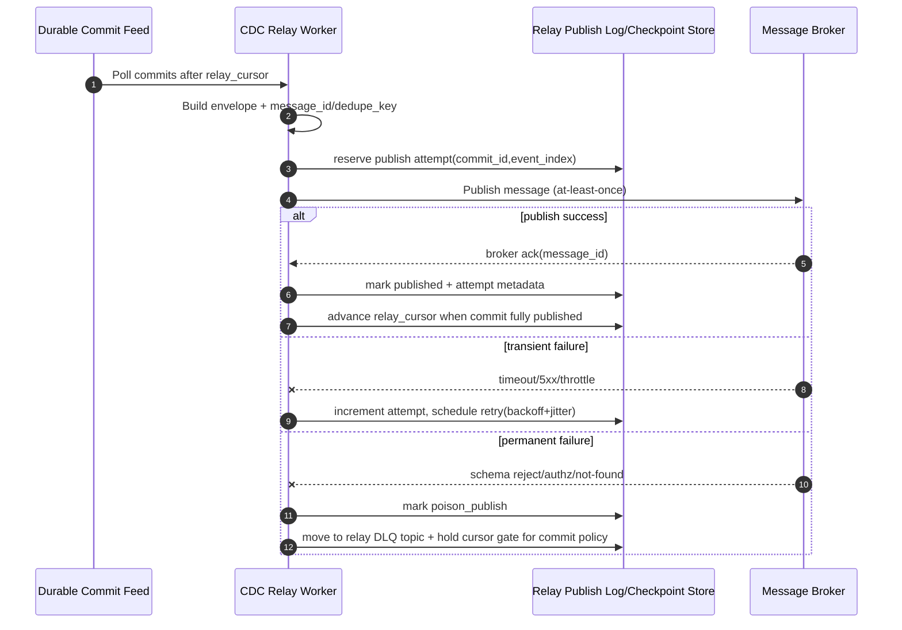
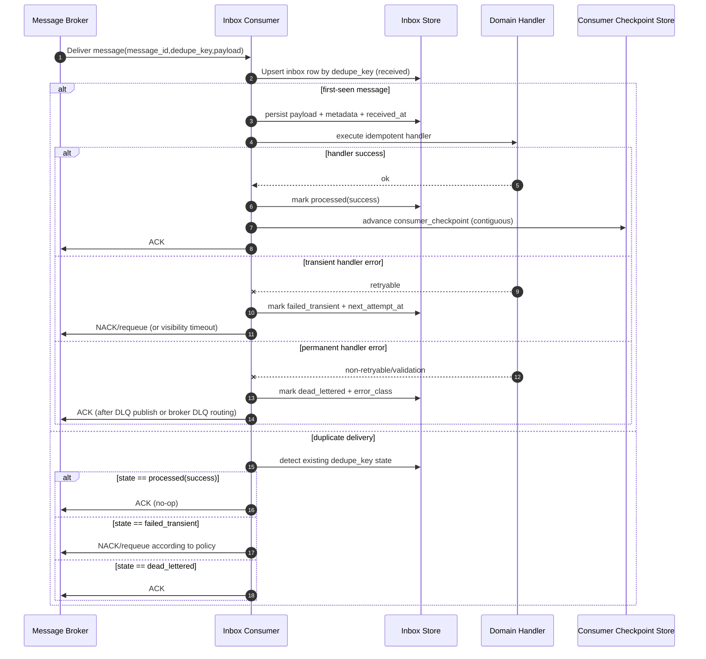

# CDC Relay to MQ and Inbox Durability Semantics

## 1. Goals and Scope

Define the runtime contract for:

1. **CDC relay publisher**: transforms durable commit feed envelopes into MQ fanout messages.
2. **Inbox consumer**: persists messages before ack, deduplicates by delivery key, and applies idempotent handler execution.
3. **Failure posture**: retry and DLQ policy for publish and consume paths.
4. **Operability**: required metrics, alerts, and checkpoints.

This architecture assumes the upstream durable commit feed contract from **redemeine-48z** (ULID cursor and ordered commit envelopes).

---

## 2. Contract Summary

### 2.1 Canonical IDs and keys

- `commit_id` (ULID): globally ordered commit identity.
- `stream_id`: aggregate or partition stream identifier.
- `event_index`: ordinal within commit envelope.
- `message_id`: deterministic `sha256(commit_id + event_index + topic)`.
- `dedupe_key`: equals `message_id` (stable across retries/replays).
- `relay_cursor`: last durable commit_id successfully checkpointed by relay.
- `consumer_checkpoint`: per consumer-group, highest *contiguously completed* inbox sequence.

### 2.2 Delivery and processing guarantees

- MQ transport: **at-least-once**.
- Consumer handler effects: **effectively-once** via `persist-before-ack + dedupe + idempotent handler`.
- Ordering:
  - Preserved per partition key (`stream_id`) by broker partitioning.
  - Not globally ordered across partitions.
- Replay safety:
  - Relay replay from cursor is safe due to deterministic message IDs.
  - Consumer replay is safe due to inbox dedupe state.

---

## 3. Sequence Diagrams

## 3.1 Publish path (CDC relay)

### Publish checkpoints

- **Checkpoint A (reservation)**: intent to publish is persisted before network call.
- **Checkpoint B (broker ack)**: publish marked successful only after broker confirmation.
- **Checkpoint C (cursor advance)**: relay cursor moves only when all messages in commit are either published or explicitly policy-handled.

## 3.2 Consume path (inbox durability)

### Consume checkpoints

- **Checkpoint 1 (persist-before-ack)**: inbox row exists before any ACK.
- **Checkpoint 2 (effect applied)**: handler success persisted before ACK.
- **Checkpoint 3 (checkpoint advance)**: consumer checkpoint only after contiguous success window.

---

## 4. Retry and DLQ Policy

## 4.1 Publisher (relay) policy

- Classification:
  - **Retryable**: network timeouts, broker unavailable, rate limit.
  - **Non-retryable**: malformed envelope, authz denied, unknown topic.
- Backoff: exponential with jitter, e.g. `base=500ms, factor=2, max=5m`.
- Attempt budget: default `max_attempts=12` before DLQ.
- DLQ payload must include:
  - original envelope
  - `commit_id`, `message_id`, attempt count
  - error class + last error message + first/last failure timestamps

## 4.2 Consumer (inbox) policy

- Retryable handler errors: retry with capped exponential backoff and attempt counter stored in inbox row.
- Permanent errors: mark dead-lettered and stop redelivery loop.
- Poison heuristic: same dedupe_key failing with equivalent stack fingerprint beyond threshold triggers immediate DLQ.
- Replay policy: operator can replay from DLQ by re-enqueueing same payload; dedupe prevents duplicate side effects if already completed.

---

## 5. Data Model (minimal)

### 5.1 Relay publish log/checkpoint

- `relay_publish_attempts`:
  - PK `(commit_id, event_index, topic)`
  - `message_id`, `status`, `attempt_count`, `next_attempt_at`, `last_error_class`, `updated_at`
- `relay_cursor`:
  - `relay_name`, `last_commit_id`, `updated_at`

### 5.2 Inbox store

- `inbox_messages`:
  - PK `dedupe_key`
  - `message_id`, `partition_key`, `payload_hash`, `status`
  - `attempt_count`, `next_attempt_at`
  - `received_at`, `processed_at`
  - `error_class`, `error_fingerprint`, `dead_lettered_at`
- `consumer_checkpoint`:
  - PK `(consumer_group, shard)`
  - `last_contiguous_sequence`, `last_message_id`, `updated_at`

---

## 6. Metrics and Alerts

## 6.1 Relay metrics

- Throughput:
  - `cdc_relay_messages_published_total`
  - `cdc_relay_publish_bytes_total`
- Reliability:
  - `cdc_relay_publish_failures_total{class}`
  - `cdc_relay_retry_scheduled_total`
  - `cdc_relay_dlq_total`
- Lag:
  - `cdc_relay_feed_lag_seconds` (feed head timestamp - relay cursor timestamp)
  - `cdc_relay_oldest_unpublished_age_seconds`

### Relay alerts

- **Critical**: `cdc_relay_dlq_total` increase > threshold over 5m.
- **High**: feed lag exceeds SLO (e.g. >120s for 10m).
- **High**: zero publish throughput while feed has new commits for >5m.

## 6.2 Consumer metrics

- Flow:
  - `inbox_messages_received_total`
  - `inbox_messages_processed_total`
  - `inbox_messages_acked_total`
- Reliability:
  - `inbox_handler_failures_total{class}`
  - `inbox_retry_scheduled_total`
  - `inbox_dead_lettered_total`
  - `inbox_duplicates_total`
- Latency/lag:
  - `inbox_processing_latency_ms`
  - `inbox_end_to_end_lag_seconds` (commit timestamp to processed_at)
  - `consumer_checkpoint_stall_seconds`

### Consumer alerts

- **Critical**: dead-lettered rate spike above baseline for 10m.
- **High**: checkpoint stall beyond threshold while queue depth grows.
- **High**: retry queue age p95 exceeds configured max backoff window.
- **Medium**: duplicate rate anomaly indicates potential redelivery storm.

---

## 7. Operational Runbook Semantics

1. **Replay from relay cursor**: safe; deterministic message IDs permit duplicate suppression downstream.
2. **Replay from consumer checkpoint**: safe if inbox store retained; dedupe_key prevents re-applying effects.
3. **DLQ redrive**: only after error class reclassified or handler fix deployed.
4. **Data retention**:
   - Keep processed inbox rows for at least max replay horizon.
   - Keep dedupe tombstones longer than broker redelivery retention.

---

## 8. Risks and Assumptions

### Assumptions

- Broker supports ACK/NACK or equivalent visibility semantics.
- Consumers can write inbox state transactionally with handler side-effects (or enforce compensation when split).
- Upstream commit envelopes include immutable commit timestamp and ULID commit_id.

### Risks

- Hot partition skew can stall contiguous checkpoint advancement.
- Very long inbox retention may require archival strategy.
- Cross-resource transaction gaps (inbox DB vs external side-effect target) require strict idempotency keys at integration boundaries.

---

## 9. Acceptance Mapping (redemeine-yvf)

- Contract coverage: sections 2 and 5.
- Sequence diagrams: sections 3.1 and 3.2.
- Retry/DLQ policy: section 4.
- Metrics/alerts: section 6.
