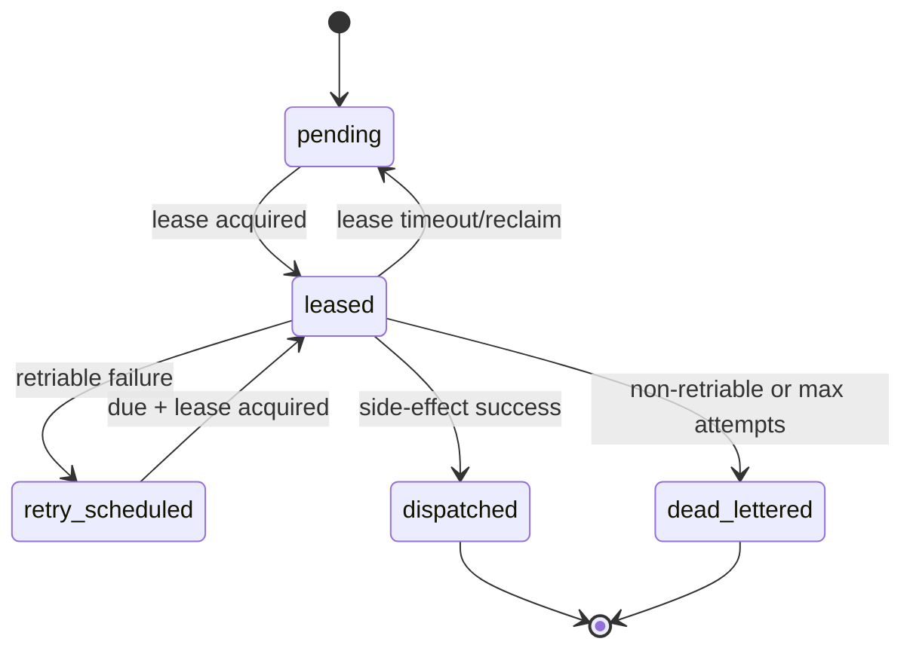

---
title: 'Transactional Outbox RFC (Tapeworm Commit Boundary + Dispatch Models)'
last_updated: 2026-04-08
status: proposed
bead: redemeine-4gu
ai_priority: high
---

# Transactional Outbox RFC (redemeine-4gu)

## 1) Problem statement

`@redemeine/mirage` currently persists events via `EventStore.saveEvents(...)` and then executes plugin `onAfterCommit` inline in the request lifecycle (`packages/mirage/src/Depot.ts`). This has two reliability gaps:

1. Side-effects are coupled to command latency/failure path.
2. Post-commit failures are not first-class persisted work items with replay/retry/dead-letter semantics.

Goal: move to an outbox-first model where append + enqueue is one atomic Tapeworm commit, and dispatch is asynchronous and recoverable.

---

## 2) Decision summary

### 2.1 Chosen atomicity boundary

Adopt a **Tapeworm packaged commit boundary** as the only valid atomic write boundary for append + outbox enqueue.

- The runtime asks a Tapeworm-capable adapter to persist:
  - aggregate stream events,
  - outbox rows/intents,
  - and commit envelope metadata,
  in a **single durable commit unit**.
- If adapter cannot provide this guarantee, it is non-conformant for outbox-primary mode.

### 2.2 Chosen dispatch model

Adopt **Model A (Transactional outbox rows + worker)** as the canonical cross-adapter strategy.

Model B (Mongo change streams) is allowed as an optimization adapter-layer trigger for Mongo deployments but not the portability baseline.

---

## 3) Model A vs B comparison

| Dimension | A: Outbox rows + worker | B: Mongo change streams |
| --- | --- | --- |
| Portability (Mongo/IndexedDB/other Tapeworm adapters) | **High** (adapter-agnostic) | **Low** (Mongo-specific) |
| Append+enqueue atomicity | **Strong** (same commit unit) | Medium (depends on document model and stream lag/window) |
| Replay/backfill control | **Strong** (cursor over outbox table) | Weaker (window handling and resume token expiry concerns) |
| Retry/dead-letter policy ownership | **Runtime-owned, explicit** | Split between stream infra + runtime |
| Operational complexity | Moderate, predictable | Higher (stream operations, resume tokens, failover tuning) |
| Multi-adapter fit | **Excellent** | Poor |

### Recommendation

- **Primary**: Model A for all adapters.
- **Optional**: Model B may be used only as a wake-up signal for a worker that still processes durable outbox state.

---

## 4) Tapeworm commit boundary contract

## 4.1 Commit port (runtime-facing)

```ts
export interface TapewormCommitPort {
  supportsAtomicOutbox(): boolean;

  /**
   * Must atomically persist stream append + outbox enqueue + commit envelope.
   * Either all are durable, or none are.
   */
  commitWithOutbox(input: {
    aggregateId: string;
    expectedVersion?: number;
    events: readonly Event[];
    outbox: readonly OutboxMessageToEnqueue[];
    commit: TapewormCommitEnvelope;
  }): Promise<{
    commitId: string; // ULID or monotonic sortable id
    streamVersion: number;
    enqueuedCount: number;
  }>;

  /** Fallback legacy path when outbox disabled by config */
  saveEvents?(aggregateId: string, events: readonly Event[], expectedVersion?: number): Promise<void>;
}
```

## 4.2 Adapter conformance requirements

A Tapeworm adapter is outbox-conformant iff:

1. **Atomicity**: no visible state exists where events are appended but corresponding outbox messages are missing (or inverse) for one commit.
2. **Durability**: successful return means both stream and outbox records survive crash/restart.
3. **Ordering**: commitId ordering is monotonic per adapter storage order and stable for cursoring.
4. **Idempotent commit identity**: duplicate commit attempts with same dedupe key do not create duplicate outbox messages.
5. **Visibility rule**: worker can observe only committed rows.

---

## 5) Outbox message schema and invariants

```ts
type OutboxStatus =
  | 'pending'
  | 'leased'
  | 'dispatched'
  | 'retry_scheduled'
  | 'dead_lettered';

interface OutboxMessage {
  messageId: string;          // stable id (ULID)
  commitId: string;           // Tapeworm commit envelope id
  aggregateId: string;
  aggregateVersion: number;
  pluginKey: string;
  intentType: string;
  payload: Record<string, unknown>;
  idempotencyKey: string;     // stable key for external side-effect dedupe
  attemptCount: number;
  nextAttemptAt: string;      // ISO timestamp
  leasedUntil?: string;
  leaseOwner?: string;
  status: OutboxStatus;
  createdAt: string;
  updatedAt: string;
  lastError?: {
    code: string;
    message: string;
    retriable: boolean;
  };
}
```

### Invariants

1. `messageId` unique globally.
2. `idempotencyKey` deterministic from `(pluginKey, aggregateId, commitId, intentType, logicalIntentRef)`.
3. Status transitions are monotonic and valid per state machine (below).
4. `attemptCount` increments only on actual dispatch attempt.
5. `dead_lettered` is terminal.

---

## 6) Dispatch worker lifecycle and state machine

## 6.1 Worker responsibilities

1. Poll or wake on new pending work.
2. Lease a bounded batch (`pending/retry_scheduled` and due).
3. Execute plugin/intent side-effect with idempotency metadata.
4. Ack success (`dispatched`) or classify failure:
   - retriable -> backoff + `retry_scheduled`
   - non-retriable / max-attempts reached -> `dead_lettered`
5. Emit inspection hooks + telemetry at each transition.

## 6.2 State machine



### Transition guards

- `leased -> retry_scheduled` requires computed `nextAttemptAt` using retry policy.
- `leased -> dead_lettered` if `attemptCount >= maxAttempts` OR failure is non-retriable.
- lease reclaim allowed when `leasedUntil < now`.

---

## 7) Interface seams (implementation-ready)

```ts
export interface OutboxPersistencePort {
  enqueueInCommit(input: EnqueueInCommitInput): Promise<EnqueueInCommitResult>;
  leaseDue(batchSize: number, nowIso: string, leaseMs: number, workerId: string): Promise<readonly OutboxMessage[]>;
  markDispatched(messageId: string, nowIso: string): Promise<void>;
  markRetryScheduled(messageId: string, update: {
    nowIso: string;
    nextAttemptAt: string;
    error: OutboxMessage['lastError'];
  }): Promise<void>;
  markDeadLettered(messageId: string, update: {
    nowIso: string;
    error: OutboxMessage['lastError'];
  }): Promise<void>;
  reclaimExpiredLeases(nowIso: string): Promise<number>;
}

export interface OutboxDispatcher {
  dispatch(message: OutboxMessage): Promise<
    | { kind: 'success' }
    | { kind: 'retry'; error: { code: string; message: string } }
    | { kind: 'dead-letter'; error: { code: string; message: string } }
  >;
}
```

---

## 8) Migration strategy from inline `onAfterCommit`

## 8.1 Modes

- `legacy_inline` (current): `saveEvents` then inline `onAfterCommit`.
- `outbox_primary` (target): `commitWithOutbox`; no inline side-effects.
- `dual_write_shadow` (temporary): outbox row creation + inline execution for parity validation (no worker dispatch to external systems in shadow unless explicitly enabled).

## 8.2 Rollout phases

1. **Phase 0 – Contract landing**
   - Introduce Tapeworm commit/outbox interfaces and feature flags.
2. **Phase 1 – Atomic persistence**
   - Implement `commitWithOutbox` path in mirage depot.
3. **Phase 2 – Worker + retries**
   - Deliver dispatcher loop, lease/retry/dead-letter behavior.
4. **Phase 3 – Cutover**
   - Enable `outbox_primary` by default for conformant adapters.
5. **Phase 4 – Removal**
   - Deprecate inline `onAfterCommit` path from production mode.

---

## 9) Failure matrix (minimum)

| Failure point | Expected result |
| --- | --- |
| Append fails before commit | no stream append, no outbox rows |
| Outbox enqueue fails inside commit | no stream append, no outbox rows |
| Crash after commit before dispatch | rows remain pending and are retried by worker |
| Worker crash during lease | lease expires and message is reclaimed |
| Side-effect timeout/retriable error | retry_scheduled with backoff |
| Non-retriable side-effect error | dead_lettered with classified error |

---

## 10) Target files (planned implementation map)

### New/updated runtime contracts
- `packages/mirage/src/Depot.ts` (replace inline post-commit path behind mode switch)
- `packages/mirage/src/outbox.ts` (new: message types, persistence/dispatch interfaces)
- `packages/mirage/src/tapewormCommitPort.ts` (new: atomic commit contract)
- `packages/mirage/src/index.ts` (export new contracts)

### Adapter integrations (likely follow-up beads)
- Tapeworm Mongo adapter: atomic commit + outbox write in one transaction unit
- Tapeworm IndexedDB adapter: atomic commit + outbox write in one database transaction

### Saga-runtime touchpoints (optional bridge)
- `packages/saga-runtime/src/referenceAdapters.ts` (reuse retry/dead-letter semantics where compatible)
- `packages/saga-runtime/src/runtimeObservabilityContracts.ts` (align outbox lifecycle observability event names)

---

## 11) Target tests

### Mirage unit/integration
- `packages/mirage/test/Depot.test.ts`
  - append+enqueue atomic rollback tests
  - no inline side-effect execution in `outbox_primary`
  - compatibility coverage for `legacy_inline`
- `packages/mirage/test/Depot.outbox.integration.test.ts` (new)
  - lease/retry/dead-letter lifecycle
  - idempotency key stability

### Contract tests
- `packages/mirage/test/TapewormCommitPort.contract.test.ts` (new)
  - adapter conformance invariants

### Optional saga-runtime alignment
- `packages/saga-runtime/test/runtime-observability-contracts.test.ts`
  - include outbox dispatch lifecycle event shape checks

---

## 12) Risks and assumptions

Assumptions:
- Tapeworm adapters can expose a shared commit envelope identity (`commitId`) consumable by outbox processing.
- Plugin side-effects can accept idempotency metadata without breaking existing plugin contracts.

Risks:
- Adapter capability mismatch across environments (must be explicit via capability negotiation).
- Legacy plugins expecting inline execution timing may require migration guidance.

Mitigation:
- feature-flagged rollout + dual-write shadow validation + contract test suite for adapters.

---

## 13) Acceptance mapping (redemeine-4gu)

This RFC includes:
- Tapeworm commit boundary definition and adapter conformance requirements.
- Dispatch model A/B comparison with recommendation matrix.
- Explicit interfaces, state machine, invariants, failure matrix, and phased rollout.
- Concrete target files and tests for Engineer handoff.
